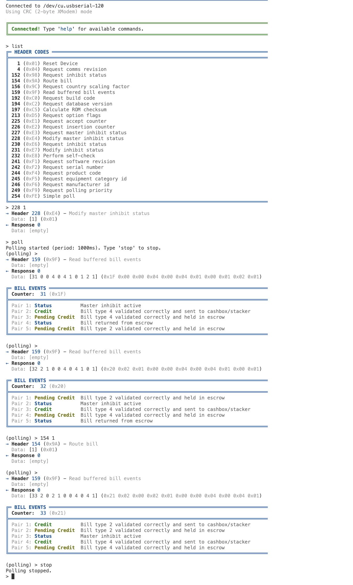

# ccTalk Host - Bill Validator Interface

An interactive command-line interface for communicating with ccTalk-compatible bill validators via serial port. Support for both CRC and checksum validation modes.

A polling option will periodically poll the validator but will only show response if that is different from the previous response. During polling the user will have a normal prompt to 'inject' commands. Raw output and interpretation of the reponse is displayed. 



## Requirements

- Python 3.6 or higher
- pyserial library
- A ccTalk-compatible bill validator connected via serial port

## Installation

### macOS / Linux

1. Create a virtual environment (recommended):
   ```bash
   python3 -m venv .venv
   source .venv/bin/activate
   ```
2. Install dependencies:
   ```bash
   pip install pyserial
   ```
3. Run the script:
   ```bash
   python3 cctalk-host.py
   ```
   Or make it executable and run directly:
   ```bash
   chmod +x cctalk-host.py
   ./cctalk-host.py
   ```

### Windows

1. Create a virtual environment (recommended):
   ```cmd
   python -m venv .venv
   .venv\Scripts\activate
   ```
2. Install dependencies:
   ```cmd
   pip install pyserial
   ```
3. Run the script:
   ```cmd
   python cctalk-host.py
   ```

**Windows-specific notes:**
- Serial ports are typically named `COM1`, `COM2`, etc. (e.g., `COM3` instead of `/dev/ttyUSB0`)
- Use Command Prompt or PowerShell (Windows Terminal recommended for better color support)
- If colors don't display correctly, the script will automatically disable them for non-terminal output

## Usage

### Command-Line Options

```bash
# Interactive mode (prompts for port and checksum mode)
python cctalk-host.py

# Command line options for serial port and crc/checksum mode (both port and mode are required)
python cctalk-host.py --port COM3 --mode crc         # Windows with CRC
python cctalk-host.py --port /dev/ttyUSB0 --mode checksum  # Linux/Mac with checksum

# Short options
python cctalk-host.py -p COM3 -m crc
```

### Interactive Commands

Once connected, you can use the following commands:

#### Basic Commands

- `help` - Show available commands
- `list` - List all header codes and their function names
- `quit` / `exit` - Exit the program

#### Sending Commands

- `<header> [data]` - Send command directly (e.g., `159` or `154 1`)
- `cmd <header> [data]` - Alternative syntax (e.g., `cmd 231 255 255`)

**Examples:**
```
> 4                    # Request comms revision
> 159                  # Read buffered bill events
> 154 1                # Route bill with data
> cmd 231 255 255      # Modify inhibit status
```

#### Polling

- `poll [period]` - Start polling command 159 every `period` milliseconds (default: 1000ms)
- `stop` - Stop polling

**Examples:**
```
> poll                 # Start polling with default 1000ms period
> poll 500             # Start polling with 500ms period
> stop                 # Stop polling
```

While polling is active, the prompt changes to `(polling) >` and bill events are automatically displayed when they change.

## Note
This script is developed on a bill validator with CRC option and no encryption. Not tested on checksum models. If you have a checksum model and do find issues, please let me know

## License

MIT License

Copyright (c) 2024

Permission is hereby granted, free of charge, to any person obtaining a copy
of this software and associated documentation files (the "Software"), to deal
in the Software without restriction, including without limitation the rights
to use, copy, modify, merge, publish, distribute, sublicense, and/or sell
copies of the Software, and to permit persons to whom the Software is
furnished to do so, subject to the following conditions:

The above copyright notice and this permission notice shall be included in all
copies or substantial portions of the Software.

THE SOFTWARE IS PROVIDED "AS IS", WITHOUT WARRANTY OF ANY KIND, EXPRESS OR
IMPLIED, INCLUDING BUT NOT LIMITED TO THE WARRANTIES OF MERCHANTABILITY,
FITNESS FOR A PARTICULAR PURPOSE AND NONINFRINGEMENT. IN NO EVENT SHALL THE
AUTHORS OR COPYRIGHT HOLDERS BE LIABLE FOR ANY CLAIM, DAMAGES OR OTHER
LIABILITY, WHETHER IN AN ACTION OF CONTRACT, TORT OR OTHERWISE, ARISING FROM,
OUT OF OR IN CONNECTION WITH THE SOFTWARE OR THE USE OR OTHER DEALINGS IN THE
SOFTWARE.

## Contributing

Contributions are welcome! Please feel free to submit a Pull Request.

